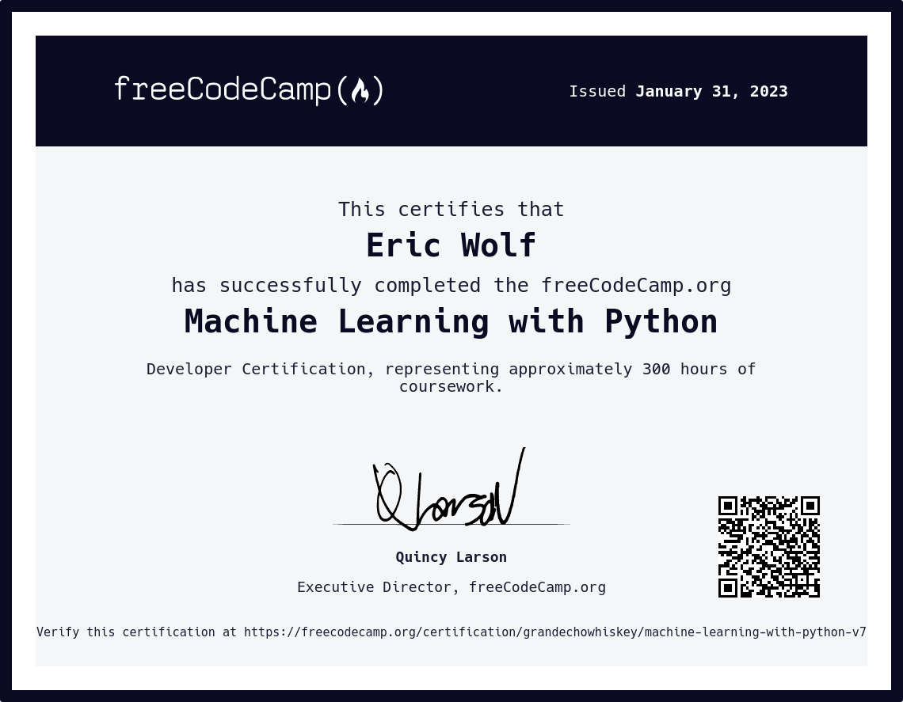

[<- Back to main](https://github.com/GrandEchoWhiskey)

<a href="https://www.freecodecamp.org/learn/machine-learning-with-python/">
   
</a>

<h1 align="center">Machine Learning with Python</h1>

 

#### freeCodeCamp course on [freecodecamp.org/learn/machine-learning-with-python][fcc_link]
##### Certificate link: [click here][certificate_link]

---

## Boilerplates:
Name | Description | Technology
:--- | :--- | :---:
[Rock Paper Scissors][rps_link] | Predict other players choices | [![Python][py_img]](#)
[Cat Dog Image Classifier][catdog_link] | Recognize cats and dogs in images | [![Python][py_img]](#)
[Book Recommendation KNN][brknn_link] | Book recommendation algorithm using K-Nearest Neighbors | [![Python][py_img]](#)
[Predict Health Costs With Regression][phcwr_link] | Predict healthcare costs using a regression algorithm | [![Python][py_img]](#)

  
---

<!-- Links -->

[fcc_link]: https://www.freecodecamp.org/learn/machine-learning-with-python/
[certificate_link]: https://www.freecodecamp.org/certification/grandechowhiskey/machine-learning-with-python-v7

[rps_link]:           bpl-1-rock_paper_scissors
[catdog_link]:        bpl-2-cat_dog
[brknn_link]:         bpl-3-book_recommendation_knn
[phcwr_link]:         bpl-4-predict_health_costs_with_regression

[py_img]: https://github.com/GrandEchoWhiskey/grandechowhiskey/blob/main/icons/programming/python.png
